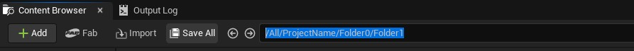
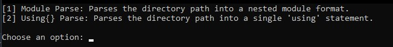
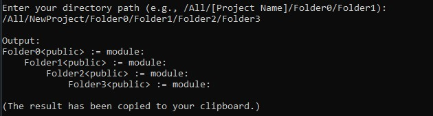
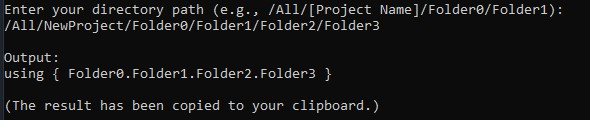

# **ExportsGenerator**

A simple yet **SUPER useful generator** for directory access using a directory path.

---

## **Setup**

1. Download the following files:
   - [ExportsGenerator.bat](src/ExportsGenerator.bat)
   - [ExportsGenerator.py](src/ExportsGenerator.py)
2. Place both files in the same directory (folder).

---

## **Execution**

1. In your **UEFN editor**, copy the desired directory path.  
   

2. Run [ExportsGenerator.bat](src/ExportsGenerator.bat).
3. Choose from the following options:
   - **Module Parse**  
   - **Using{} Parse**
   
---

## **Parse Options**

### **Module Parse**
Provide the directory path and the `Module Parsed Output` will be automatically copied to your clipboard.
 
### **Using{} Parse**
Provide the directory path and the `Using{} Parsed Output` will be automatically copied to your clipboard.
 
 
---
